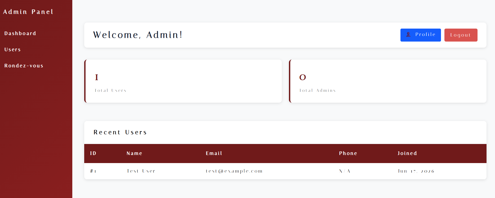
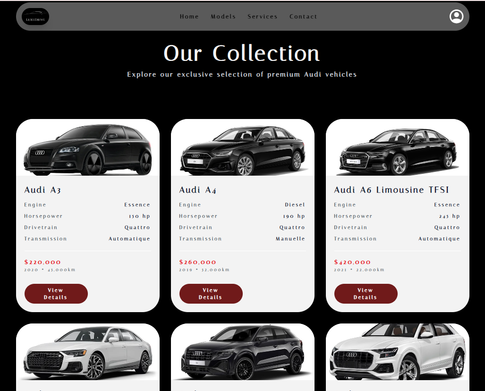
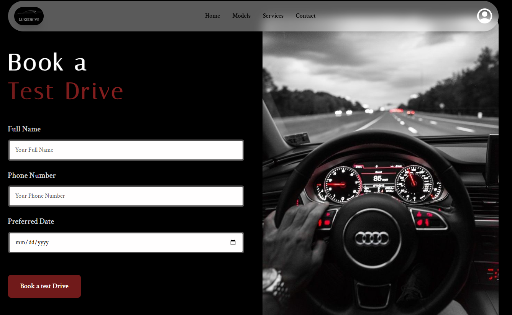
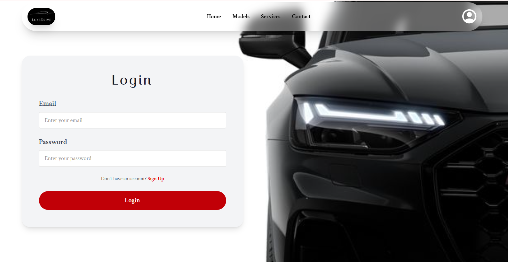
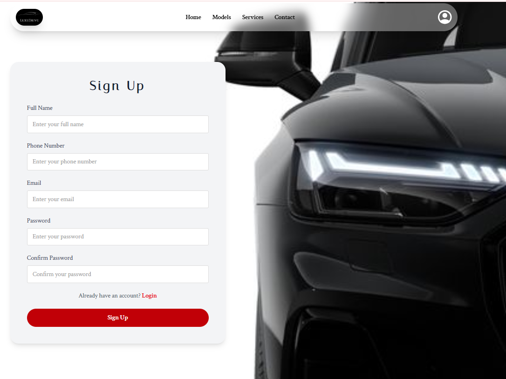
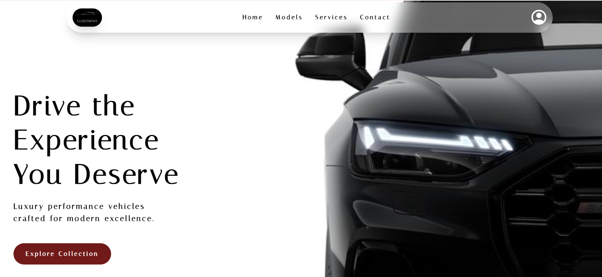

# LuxeDrive — Car Dealership Management System

**LuxeDrive** is a Laravel-based web application that helps manage a car showroom’s main activities, such as:
- Customer appointments / reservations
- Test drive requests
- Car inventory management
- Employee/admin management
- Sales (Ventes) and related operations

This project is designed for a **student portfolio** and demonstrates common web application features (authentication, dashboards, CRUD operations, database design, and MVC structure).

---

## Features
- **Authentication & Roles** (User / Employee / Admin)
- **Admin Dashboard** and management pages
- **Customers management** (clients)
- **Cars (Voitures) management**
- **Test Drives (TestDrive)** management
- **Appointments / Reserves (Rendez-Vous / Reserves)** management
- **Sales (Ventes)** management
- **Database seeding** for demo data

---

## Tech Stack
- **Backend:** PHP, Laravel Framework
- **Frontend:** Blade templates, JavaScript, Vite
- **Database:** MySQL 
- **Tools:** Composer, npm

---

## Project Structure (MVC)
- `app/Http/Controllers/` — request handling and business logic
- `app/Models/` — database models (Eloquent)
- `routes/` — route definitions
- `resources/views/` — Blade UI templates
- `database/migrations/` — schema migrations
- `database/seeders/` — seed demo data

---

## Installation

### 1) Clone the repository
```bash
git clone <repository-url>
cd LuxeDrive-app
```

### 2) Install PHP dependencies
```bash
composer install
```

### 3) Configure environment variables
Create a `.env` file:
```bash
copy .env.example .env
```
Then update database credentials in `.env`.

### 4) Generate application key
```bash
php artisan key:generate
```

### 5) Run database migrations
```bash
php artisan migrate
```

### 6) (Optional) Seed demo data
```bash
php artisan db:seed
```

### 7) Install frontend dependencies and build assets
```bash
npm install
npm run dev
```

---

## Running the Project
### Development server
```bash
php artisan serve
```
Then open:
- `http://127.0.0.1:8000`

---

## Testing
To run the test suite:
```bash
php artisan test
```


## Screenshots / Demo
- Admin dashboard

- Cars list

- Test drive requests

- Authentification(login/signup)


- Home (Hero section)


---

## Student Information
- **Author:** Ikram
- **Date:** 06/20/2026

---

## License
This project is for educational purposes. 
